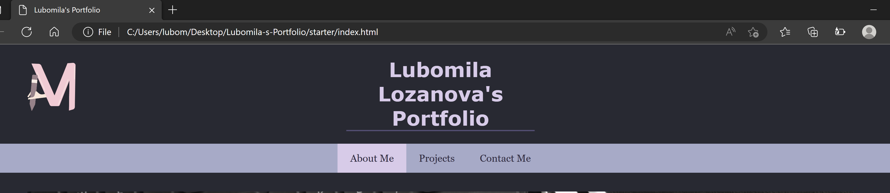
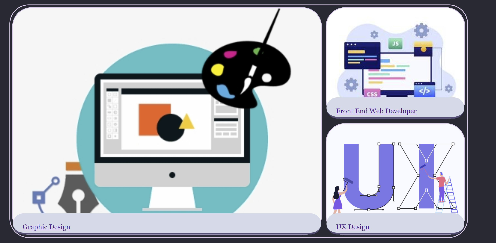
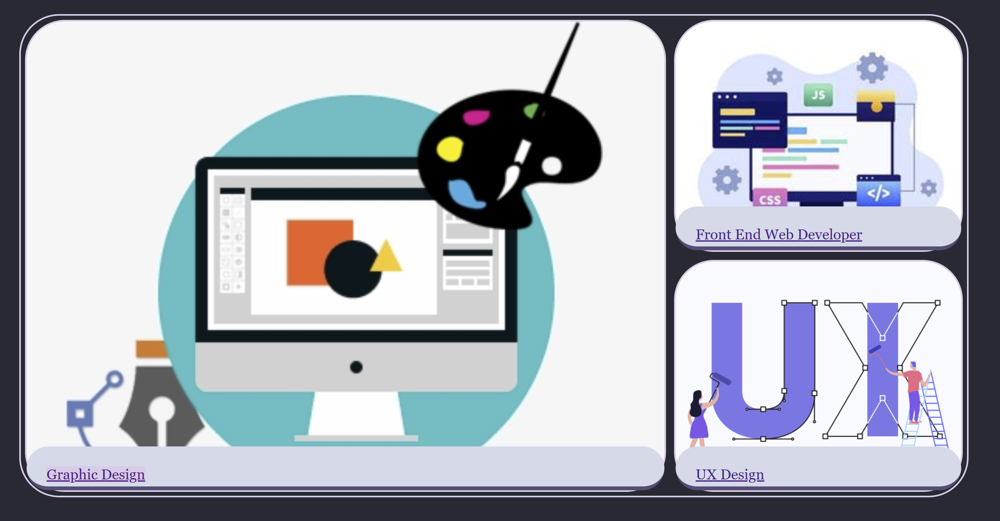

# Lubomila-s-Portfolio

## Table of Contents 

- [Description](#description)
- [Usage](#usage)
- [Features](#features)
- [Installation](#installation)
- [Credits](#credits)
- [License](#license)

## Description

"Lubomila's Portfolio" is a project, which aims to showcase my work and my continuous development. With this challenge, I would like to show my projects, information about me, increases my visibility and online presence, and build my professional identity. This weekly activity targets particular skills, which I developed by this point - accessibility, flexbox, media queries, and CSS variables.

## Installation

N/A

## Usage

The list shows what changes were made to improve the website:

- When the page is loaded the page presents my name, my logo, and links to sections about me, my projects and contact information.
- Clicking on one of the sections in the navigation bar, the UI scrolls to the corresponding section. 

- I presented the main subject of the website with a banner image and a list of skills, which I have.
- Considering the aesthetic of my brand, I carefully chose the colour scheme.
- To apply the color palette easily, I used CSS Variables.
- In the "Projects" section I added three images, which are connected to the three fields of practice that I work on. To make the images representable I used the command in CSS - grid. So, the result is one bigger image and 2 smaller images on top of each other. 
- I added a subheading on all three images. Clicking on the subheading will lead the viewer to an external website:
   1. Clicking on "Graphic Design" will lead the viewer to my Behance profile. 
   2. Clicking on "Front End Web Developer" is leading to my GitHub account.
   3. Unfortunately, I have no work to show regarding "User Experience Design" that's why for now I connected the link to my GitHub account.

- The HTML links are displayed in a different color depending on whether it has been active or the mouse is over the link.

- The images in the "Projects" section were downloaded from the internet, just to give an idea of how the website should look like. 
- "Contact Me" section indcludes my location,phone number and email. 
- In order the website to be responsive I used media queries in CSS styles according to the device's type.
   1.  I used media query with max-width: 600px, in order to target small devices (phones, 600px and down).
   
   The screen size in this demo is 468px.

   2. I used media query with max-width:768px , in order to target medium devices (landscape tablets ).
   Please,follow the gif for more information:
   
   The screen size in this demo is 743px.
   3. I used media query with min-width:300px and max-width:480px , in order to target small devices (phones ).
   Please,follow the gif for more information:
   
   The screen size in this demo is 743px.

## Features
- User Friendly
- Semantic Structure
- SEO – Search Engine Optimisation
- Web accessibility 
- Flexbox
- Media queries
- CSS variables

## Installation

N/A

## Credits

N/A

## License

milla56/Lubomila-s-Portfolio is licensed under the

MIT License
A short and simple permissive license with conditions only requiring preservation of copyright and license notices. Licensed works, modifications, and larger works may be distributed under different terms and without source code.